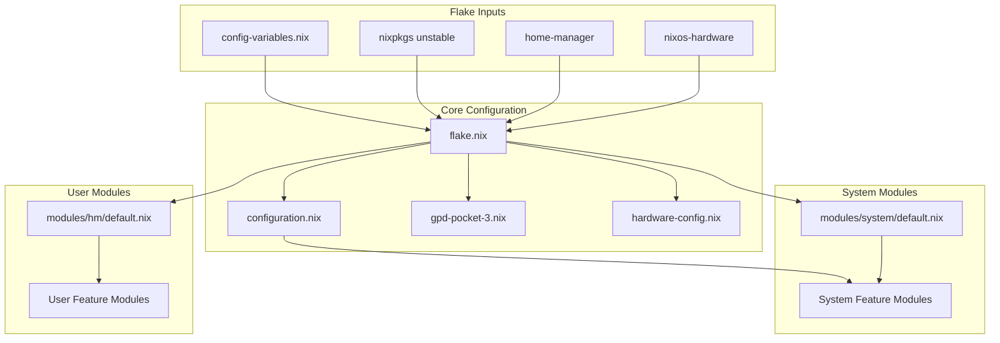
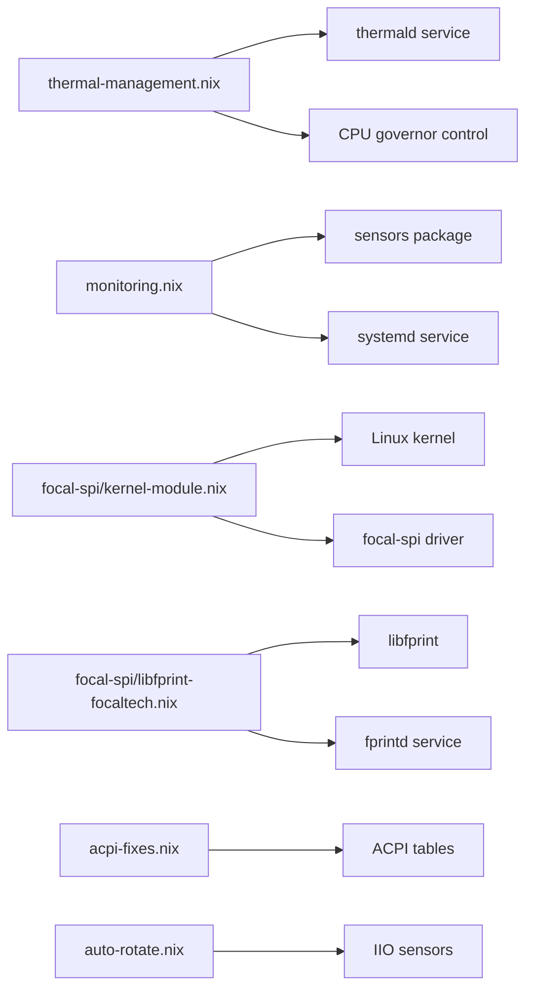
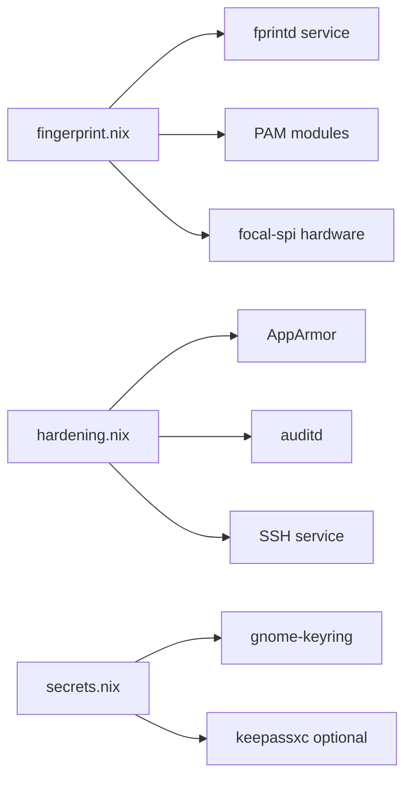
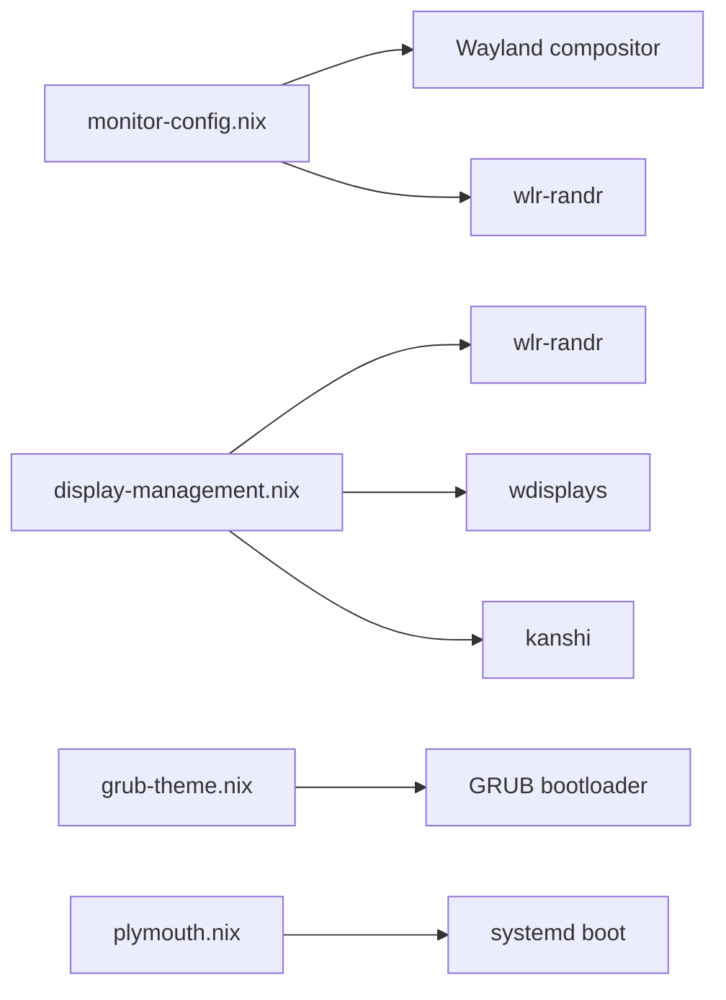
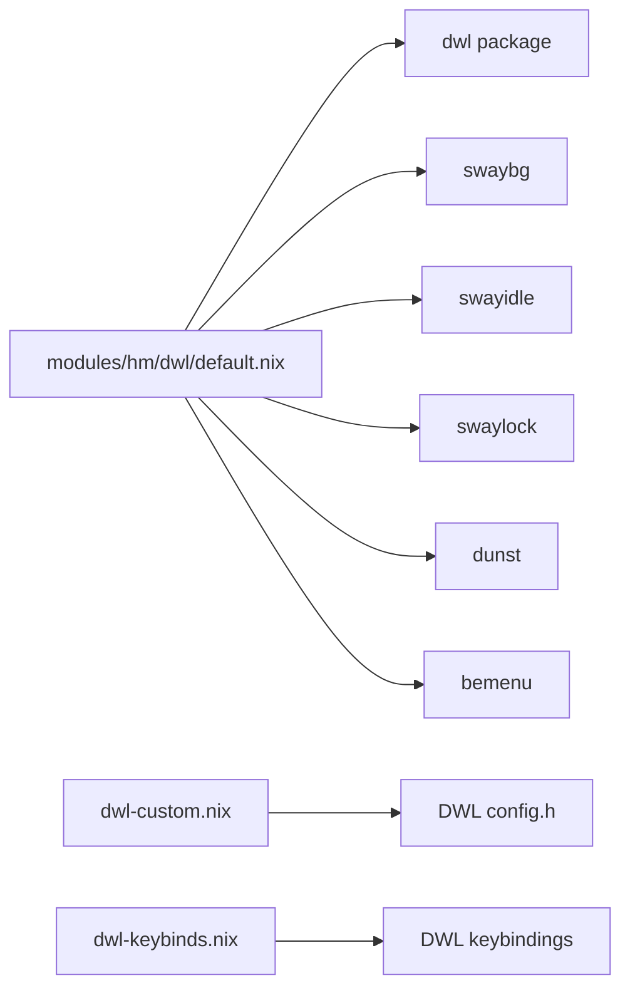
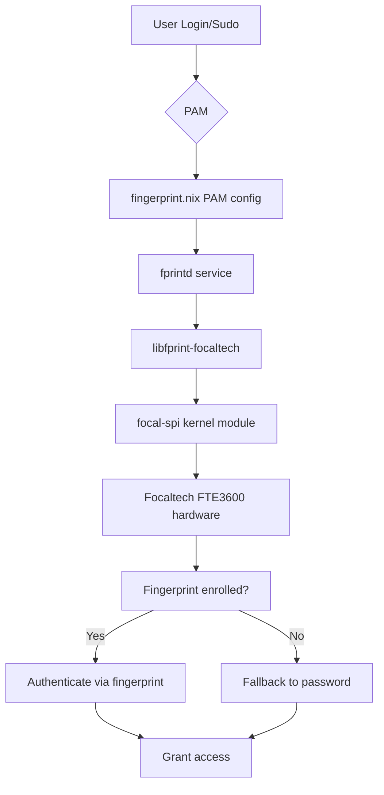
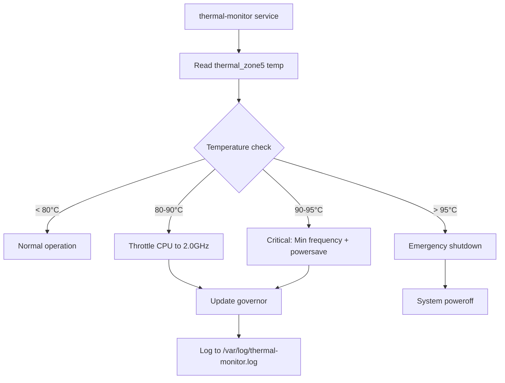
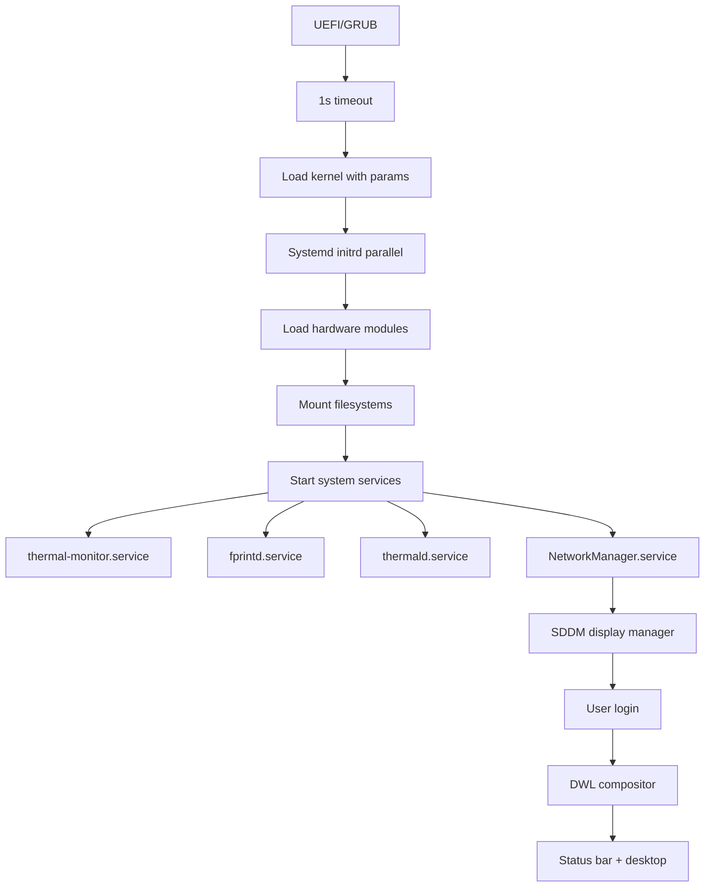

# Module Dependency Graph

Visual representation of module relationships and dependencies in the NaN NixOS configuration.

---

## 🏗️ System Architecture Overview



---

## 📦 Module Import Hierarchy

### System Module Tree

```
modules/system/default.nix
├── imports
│   ├── ./hardware/default.nix
│   │   ├── thermal-management.nix
│   │   ├── monitoring.nix
│   │   ├── acpi-fixes.nix
│   │   ├── auto-rotate.nix
│   │   └── focal-spi/default.nix
│   │       ├── kernel-module.nix
│   │       └── libfprint-focaltech.nix
│   │
│   ├── ./security/default.nix
│   │   ├── fingerprint.nix
│   │   ├── hardening.nix
│   │   └── secrets.nix
│   │
│   ├── ./packages/default.nix
│   │   ├── email.nix
│   │   └── display-rotation.nix
│   │
│   ├── ./input/default.nix
│   │   ├── keyd.nix
│   │   └── vial.nix
│   │
│   ├── ./network/default.nix
│   │   └── iphone-usb-tethering.nix
│   │
│   ├── ./power/default.nix
│   │   └── suspend-control.nix
│   │
│   ├── ./backup.nix
│   ├── ./wayland-screenshare.nix
│   ├── ./boot.nix
│   ├── ./plymouth.nix
│   ├── ./monitor-config.nix
│   ├── ./display-management.nix
│   ├── ./grub-theme.nix
│   ├── ./mpd.nix
│   ├── ./dwl-custom.nix
│   ├── ./dwl-keybinds.nix
│   ├── ./touchscreen-pen.nix
│   └── ./update-alias.nix
│
└── custom.system configuration
    ├── monitor.*
    ├── hardware.*
    ├── security.*
    ├── network.*
    ├── power.*
    ├── displayManagement.*
    ├── packages.*
    └── input.*
```

### Home Manager Module Tree

```
modules/hm/default.nix
├── imports
│   ├── ./applications/default.nix
│   │   ├── firefox.nix
│   │   ├── ghostty.nix
│   │   ├── mpv.nix
│   │   ├── btop.nix
│   │   └── music-players.nix
│   │
│   ├── ./audio/default.nix
│   │   ├── mpd.nix
│   │   └── easyeffects.nix
│   │
│   ├── ./desktop/default.nix
│   │   ├── theme.nix
│   │   ├── touchscreen.nix
│   │   ├── gestures.nix
│   │   ├── animations.nix
│   │   └── auto-rotate-service.nix
│   │
│   └── ./dwl/default.nix
│
└── custom.hm configuration
    ├── dwl.*
    ├── applications.*
    ├── audio.*
    ├── desktop.*
    ├── gestures.*
    └── animations.*
```

---

## 🔗 Module Dependencies

### Hardware Module Dependencies



### Security Module Dependencies



### Display Module Dependencies



### DWL Module Dependencies



---

## 🌐 Cross-Module Interactions

### Fingerprint Authentication Flow



### Thermal Management Flow



### Display Configuration Flow

```mermaid
graph TD
    A[GRUB bootloader] --> B[gfxmodeEfi 1200x1920]
    B --> C[Kernel fbcon rotate:1]
    C --> D[Wayland DWL]
    D --> E[monitor-config.nix]
    E --> F[DSI-1 output]
    F --> G[1200x1920@60 resolution]
    G --> H[Transform: 3 270° rotation]
    H --> I[Scale: 1.5 HiDPI]
    J[touchscreen.nix] --> K[Touchscreen calibration]
    K --> L[Rotated touch coordinates]
```

### Boot Sequence Flow



---

## 🔄 Module Interaction Patterns

### Pattern 1: Hardware → Service → Configuration

**Example: Fingerprint Authentication**

```
focal-spi/kernel-module.nix (hardware driver)
    ↓
focal-spi/libfprint-focaltech.nix (library integration)
    ↓
security/fingerprint.nix (service enablement)
    ↓
PAM configuration (authentication integration)
    ↓
SDDM/sudo/swaylock (application integration)
```

### Pattern 2: System Module → User Module

**Example: Display Configuration**

```
modules/system/monitor-config.nix (system display settings)
    ↓
modules/hm/desktop/touchscreen.nix (user touchscreen calibration)
    ↓
modules/hm/desktop/auto-rotate-service.nix (user rotation service)
```

### Pattern 3: Conditional Enablement

**Example: MPD Service**

```
modules/system/mpd.nix (disabled by default)
    ↓
modules/hm/audio/mpd.nix (enabled for user)
    ↓
Reason: Avoid port conflict (both use 6600)
```

---

## 📊 Module Dependency Matrix

| Module | Depends On | Provides For |
|--------|-----------|--------------|
| **thermal-management.nix** | thermald, sensors | System thermal protection |
| **focal-spi/kernel-module.nix** | Linux kernel | Fingerprint hardware driver |
| **focal-spi/libfprint-focaltech.nix** | libfprint, fprintd | Fingerprint library support |
| **security/fingerprint.nix** | focal-spi, fprintd, PAM | SDDM/sudo/swaylock auth |
| **security/hardening.nix** | AppArmor, auditd, SSH | System-wide security |
| **monitor-config.nix** | Wayland, wlr-randr | Display configuration |
| **display-management.nix** | wlr-randr, wdisplays, kanshi | Display tools |
| **boot.nix** | systemd, GRUB | Fast boot optimization |
| **plymouth.nix** | systemd, Plymouth | Boot splash screen |
| **dwl/default.nix** | dwl, swaybg, swayidle, dunst | DWL compositor session |
| **audio/mpd.nix** | MPD daemon | Music playback |
| **audio/easyeffects.nix** | EasyEffects, PipeWire | Audio effects processing |
| **network/iphone-usb-tethering.nix** | NetworkManager | Auto iPhone USB connection |
| **power/suspend-control.nix** | systemd-logind | Lid behavior control |

---

## 🎯 Critical Dependency Chains

### Boot Critical Path

```
UEFI → GRUB (grub-theme.nix)
    ↓
Kernel (boot.nix params)
    ↓
Systemd initrd (boot.nix)
    ↓
Plymouth (plymouth.nix)
    ↓
Hardware modules (hardware/*)
    ↓
SDDM (configuration.nix)
    ↓
User session (home-manager)
```

### Authentication Critical Path

```
Hardware (focal-spi/kernel-module.nix)
    ↓
Library (focal-spi/libfprint-focaltech.nix)
    ↓
Service (fprintd enabled via security/fingerprint.nix)
    ↓
PAM (security/fingerprint.nix PAM config)
    ↓
Applications (SDDM/sudo/swaylock)
```

### Display Critical Path

```
GRUB (grub-theme.nix resolution)
    ↓
Kernel (gpd-pocket-3.nix fbcon rotation)
    ↓
Wayland (DWL compositor)
    ↓
Monitor config (monitor-config.nix)
    ↓
Touchscreen (desktop/touchscreen.nix)
    ↓
Auto-rotate (desktop/auto-rotate-service.nix)
```

---

## 🔍 Module Conflict Resolution

### Identified Conflicts

| Conflict | Resolution |
|----------|-----------|
| **System MPD vs User MPD** | Disable `custom.system.mpd.enable`, use `custom.hm.audio.mpd.enable` |
| **Display rotation layers** | Kernel (fbcon) → Wayland (transform) → Touchscreen (calibration) |
| **Security: Password vs Fingerprint** | Both enabled, fingerprint first via PAM `sufficient` |
| **Boot: GRUB vs Plymouth themes** | Both can coexist (GRUB before kernel, Plymouth after) |

### Best Practices

1. **Prefer Home Manager for user services** (e.g., MPD)
2. **System modules for hardware** (e.g., fingerprint, thermal)
3. **Avoid duplicate service enablement** across system/user
4. **Use `mkIf cfg.enable`** for conditional module loading

---

## 🛠️ Development Patterns

### Adding a New Module

**Step 1: Identify Dependencies**
```
1. Does it require hardware access? → modules/system/
2. Is it user-specific? → modules/hm/
3. Does it depend on existing modules? → Check dependency matrix
```

**Step 2: Create Module File**
```nix
{ config, lib, pkgs, ... }:
with lib;
let cfg = config.custom.system.newFeature;
in {
  options.custom.system.newFeature = {
    enable = mkEnableOption "description";
  };
  config = mkIf cfg.enable {
    # Implementation
  };
}
```

**Step 3: Import in Parent**
```nix
# modules/system/default.nix or modules/hm/default.nix
imports = [ ./newFeature.nix ];
```

**Step 4: Enable in Configuration**
```nix
custom.system.newFeature.enable = true;
```

### Avoiding Circular Dependencies

**Bad:**
```nix
# module-a.nix
imports = [ ./module-b.nix ];

# module-b.nix
imports = [ ./module-a.nix ];
```

**Good:**
```nix
# modules/system/default.nix
imports = [
  ./module-a.nix
  ./module-b.nix
];
```

---

## 📈 Module Complexity Metrics

| Module Category | File Count | Dependency Depth | Complexity |
|----------------|------------|------------------|------------|
| **Hardware** | 7 files | 3 levels | High |
| **Security** | 4 files | 2 levels | Medium |
| **Display** | 5 files | 2 levels | Medium |
| **DWL** | 3 files | 2 levels | Medium |
| **Audio** | 3 files | 1 level | Low |
| **Input** | 3 files | 1 level | Low |
| **Network** | 2 files | 1 level | Low |
| **Power** | 2 files | 1 level | Low |

**Total System Modules:** 35 files (including 8 aggregators)
**Total Home Manager Modules:** 17 files (including 5 aggregators)
**Total Modules:** 52 files

---

## 🔗 See Also

- [PROJECT_INDEX.md](PROJECT_INDEX.md) - Master navigation
- [MODULE_API.md](MODULE_API.md) - Complete options reference
- [ARCHITECTURE.md](ARCHITECTURE.md) - System design patterns
- [FILE_REFERENCE.md](FILE_REFERENCE.md) - Quick file lookup

---

*Last Updated: 2025-10-07*
