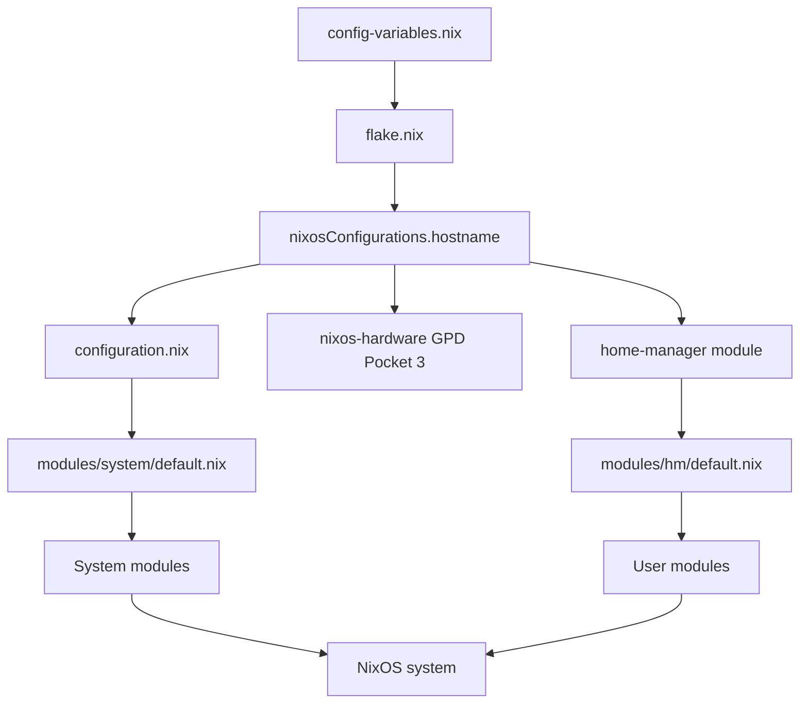

# NaN Project Index

**Version:** Production (2025-10-07)
**System:** NixOS configuration for GPD Pocket 3
**Compositor:** DWL (dwm for Wayland)

---

## 📚 Documentation Map

### Getting Started

| Document | Purpose | When to Use |
|----------|---------|-------------|
| **[README.md](README.md)** | Project overview and quick start | First-time users, feature overview |
| **[INSTALL.md](INSTALL.md)** | Detailed installation guide | Initial system setup |
| **[QUICK_REFERENCE.md](QUICK_REFERENCE.md)** | Command cheat sheet | Daily operations, troubleshooting |

### Development

| Document | Purpose | When to Use |
|----------|---------|-------------|
| **[CLAUDE.md](CLAUDE.md)** | AI assistant developer guide | Claude Code integration |
| **[ARCHITECTURE.md](ARCHITECTURE.md)** | System design and patterns | Understanding module organization |
| **[MODULE_API.md](MODULE_API.md)** | Complete `custom.*` options reference | Adding/configuring modules |
| **[CONTRIBUTING.md](CONTRIBUTING.md)** | Development guidelines | Contributing code |
| **[MODULE_DEPENDENCY_GRAPH.md](MODULE_DEPENDENCY_GRAPH.md)** | Visual module relationships | Understanding dependencies |
| **[FILE_REFERENCE.md](FILE_REFERENCE.md)** | Quick file path lookup | Finding specific files |

### Operations

| Document | Purpose | When to Use |
|----------|---------|-------------|
| **[DEPLOYMENT.md](DEPLOYMENT.md)** | Deployment procedures | Production deployment |
| **[docs/DWL_KEYBINDINGS.md](docs/DWL_KEYBINDINGS.md)** | Complete keybinding reference | Window manager usage |
| **[docs/LOCK_SCREEN_INTEGRATION.md](docs/LOCK_SCREEN_INTEGRATION.md)** | Lock screen configuration | Security setup |
| **[docs/GPD_POCKET_3_ANIMATIONS.md](docs/GPD_POCKET_3_ANIMATIONS.md)** | Animation system guide | Desktop customization |

---

## 🗂️ Repository Structure

```
/etc/nixos/
├── Core Configuration
│   ├── flake.nix                      # Flake inputs (nixpkgs, home-manager, nixos-hardware)
│   ├── config-variables.nix           # User customization (username, hostname, hardware profile)
│   ├── configuration.nix              # Main system config (users, SDDM, packages)
│   ├── hardware-config.nix            # Auto-generated hardware config
│   ├── hardware-configuration-fallback.nix  # Reference fallback config
│   └── gpd-pocket-3.nix              # GPD-specific optimizations
│
├── Modules
│   ├── system/                        # System-level modules (custom.system.*)
│   │   ├── default.nix               # System module aggregator with enabled features
│   │   ├── boot.nix                  # Fast boot optimization
│   │   ├── plymouth.nix              # Boot splash screen
│   │   ├── grub-theme.nix            # GRUB bootloader theming
│   │   ├── monitor-config.nix        # Display configuration
│   │   ├── display-management.nix    # Wayland display tools
│   │   ├── backup.nix                # Restic backup system
│   │   ├── mpd.nix                   # System MPD (disabled by default)
│   │   ├── dwl-custom.nix            # DWL compositor config
│   │   ├── dwl-keybinds.nix          # DWL keybinding definitions
│   │   ├── touchscreen-pen.nix       # Touchscreen and stylus support
│   │   ├── wayland-screenshare.nix   # Screen sharing support
│   │   ├── update-alias.nix          # System update aliases
│   │   │
│   │   ├── hardware/                 # Hardware integration
│   │   │   ├── default.nix           # Hardware module aggregator
│   │   │   ├── thermal-management.nix # CPU thermal monitoring
│   │   │   ├── monitoring.nix        # System health monitoring
│   │   │   ├── acpi-fixes.nix        # GPD Pocket 3 ACPI workarounds
│   │   │   ├── auto-rotate.nix       # Accelerometer-based rotation
│   │   │   └── focal-spi/            # Focaltech fingerprint sensor
│   │   │       ├── default.nix       # Focal-spi aggregator
│   │   │       ├── kernel-module.nix # Custom kernel driver
│   │   │       └── libfprint-focaltech.nix # Patched libfprint
│   │   │
│   │   ├── security/                 # Security hardening
│   │   │   ├── default.nix           # Security module aggregator
│   │   │   ├── fingerprint.nix       # PAM integration
│   │   │   ├── hardening.nix         # AppArmor, audit, SSH
│   │   │   └── secrets.nix           # Secret storage (gnome-keyring/keepassxc)
│   │   │
│   │   ├── network/                  # Network configuration
│   │   │   ├── default.nix           # Network module aggregator
│   │   │   └── iphone-usb-tethering.nix # Auto-connect iPhone USB
│   │   │
│   │   ├── power/                    # Power management
│   │   │   ├── default.nix           # Power module aggregator
│   │   │   └── suspend-control.nix   # Lid behavior configuration
│   │   │
│   │   ├── input/                    # Input device configuration
│   │   │   ├── default.nix           # Input module aggregator
│   │   │   ├── keyd.nix              # Keyboard remapping daemon
│   │   │   └── vial.nix              # QMK/VIA keyboard configurator
│   │   │
│   │   └── packages/                 # Package bundles
│   │       ├── default.nix           # Package module aggregator
│   │       ├── email.nix             # Email clients
│   │       └── display-rotation.nix  # Screen orientation tools
│   │
│   └── hm/                            # Home Manager modules (custom.hm.*)
│       ├── default.nix               # User module aggregator with enabled features
│       │
│       ├── dwl/                      # DWL compositor
│       │   └── default.nix           # DWL session and status bar
│       │
│       ├── applications/             # User applications
│       │   ├── default.nix           # Application module aggregator
│       │   ├── firefox.nix           # Firefox with Cascade theme
│       │   ├── ghostty.nix           # Ghostty terminal emulator
│       │   ├── mpv.nix               # MPV media player
│       │   ├── btop.nix              # System monitor
│       │   └── music-players.nix     # TIDAL and streaming apps
│       │
│       ├── audio/                    # Audio system
│       │   ├── default.nix           # Audio module aggregator
│       │   ├── mpd.nix               # User MPD (preferred)
│       │   └── easyeffects.nix       # Audio effects processor
│       │
│       └── desktop/                  # Desktop environment
│           ├── default.nix           # Desktop module aggregator
│           ├── theme.nix             # Catppuccin Mocha Teal theme
│           ├── touchscreen.nix       # Touchscreen calibration
│           ├── gestures.nix          # Multi-touch gesture recognition
│           ├── animations.nix        # Wayland compositor animations
│           └── auto-rotate-service.nix # Display rotation service
│
└── Documentation
    ├── README.md                     # Project overview
    ├── INSTALL.md                    # Installation guide
    ├── CLAUDE.md                     # Developer documentation
    ├── ARCHITECTURE.md               # System design
    ├── MODULE_API.md                 # Options reference
    ├── CONTRIBUTING.md               # Development guidelines
    ├── QUICK_REFERENCE.md            # Command cheat sheet
    ├── DEPLOYMENT.md                 # Deployment procedures
    ├── PROJECT_INDEX.md              # This file
    ├── MODULE_DEPENDENCY_GRAPH.md    # Module relationships
    ├── FILE_REFERENCE.md             # File path lookup
    │
    └── docs/                         # Feature-specific docs
        ├── DWL_KEYBINDINGS.md
        ├── LOCK_SCREEN_INTEGRATION.md
        └── GPD_POCKET_3_ANIMATIONS.md
```

---

## 🔧 Configuration Entry Points

### Primary Configuration Files

| File | Purpose | When to Edit |
|------|---------|--------------|
| **config-variables.nix** | User customization (username, hostname, hardware profile) | Before first build |
| **modules/system/default.nix** | System module enablement (`custom.system.*`) | Enable/disable system features |
| **modules/hm/default.nix** | User module enablement (`custom.hm.*`) | Enable/disable user features |
| **configuration.nix** | Main system config (users, packages, SDDM) | System-level changes |
| **flake.nix** | Flake inputs (nixpkgs, home-manager, hardware) | Dependency management |

### Hardware-Specific Files

| File | Purpose | When to Edit |
|------|---------|--------------|
| **gpd-pocket-3.nix** | GPD Pocket 3 optimizations | Hardware-specific tweaks |
| **hardware-config.nix** | Auto-generated hardware config | After installation |
| **modules/system/hardware/** | Hardware integration modules | Thermal, fingerprint, ACPI settings |

---

## 🎯 Quick Access by Task

### Adding a New Module

1. **Create module file:**
   ```bash
   # System module
   touch modules/system/new-feature.nix

   # Home Manager module
   touch modules/hm/applications/new-app.nix
   ```

2. **Reference:**
   - [MODULE_API.md](MODULE_API.md) - Module pattern template
   - [ARCHITECTURE.md](ARCHITECTURE.md#module-organization) - Module organization

3. **Enable:**
   - Edit `modules/system/default.nix` (system modules)
   - Edit `modules/hm/default.nix` (user modules)

### Hardware Configuration

1. **Files:**
   - Display: `modules/system/default.nix` → `custom.system.monitor`
   - Thermal: `modules/system/default.nix` → `custom.system.hardware.thermal`
   - Fingerprint: `modules/system/default.nix` → `custom.system.security.fingerprint`

2. **Reference:**
   - [MODULE_API.md#hardware](MODULE_API.md#hardware) - Hardware options
   - [CLAUDE.md#gpd-pocket-3-hardware-specifics](CLAUDE.md#gpd-pocket-3-hardware-specifics) - Hardware details

### Security Hardening

1. **Files:**
   - SSH/AppArmor: `modules/system/security/hardening.nix`
   - Fingerprint PAM: `modules/system/security/fingerprint.nix`
   - Secrets: `modules/system/security/secrets.nix`

2. **Reference:**
   - [MODULE_API.md#security](MODULE_API.md#security) - Security options
   - [ARCHITECTURE.md#security-architecture](ARCHITECTURE.md#security-architecture) - Security design

### DWL Configuration

1. **Files:**
   - DWL config: `modules/hm/dwl/default.nix`
   - Keybindings: `modules/system/dwl-keybinds.nix`
   - Status bar: `modules/hm/dwl/default.nix` (status scripts)

2. **Reference:**
   - [docs/DWL_KEYBINDINGS.md](docs/DWL_KEYBINDINGS.md) - Complete keybindings
   - [MODULE_API.md#dwl-compositor](MODULE_API.md#dwl-compositor) - DWL options

### Application Management

1. **Files:**
   - Application modules: `modules/hm/applications/*.nix`
   - System packages: `modules/system/default.nix` → `environment.systemPackages`

2. **Reference:**
   - [MODULE_API.md#applications](MODULE_API.md#applications) - Application options
   - [QUICK_REFERENCE.md#module-configuration](QUICK_REFERENCE.md#module-configuration) - Quick config

### Deployment

1. **Files:**
   - Build commands: [QUICK_REFERENCE.md#nixos-build-commands](QUICK_REFERENCE.md#nixos-build-commands)
   - Deployment guide: [DEPLOYMENT.md](DEPLOYMENT.md)

2. **Reference:**
   - [INSTALL.md](INSTALL.md) - Installation procedures
   - [QUICK_REFERENCE.md#emergency-procedures](QUICK_REFERENCE.md#emergency-procedures) - Rollback

---

## 🧩 Module Categories

### System Modules (`custom.system.*`)

| Category | Modules | Purpose |
|----------|---------|---------|
| **Boot** | boot.nix, plymouth.nix | Fast boot optimization, boot splash |
| **Display** | monitor-config.nix, display-management.nix, grub-theme.nix | Display and GRUB theming |
| **Hardware** | thermal, monitoring, focal-spi, acpi-fixes, auto-rotate | Hardware integration and drivers |
| **Security** | fingerprint, hardening, secrets | Authentication, hardening, secret storage |
| **Network** | iphone-usb-tethering | Network device integration |
| **Power** | suspend-control | Power management and lid behavior |
| **Input** | keyd, vial | Keyboard remapping and configuration |
| **Packages** | email, display-rotation | Application bundles |
| **Services** | backup, mpd, wayland-screenshare | System services |

### Home Manager Modules (`custom.hm.*`)

| Category | Modules | Purpose |
|----------|---------|---------|
| **DWL** | dwl/default.nix | Window manager, status bar, session |
| **Applications** | firefox, ghostty, mpv, btop, music-players | User applications |
| **Audio** | mpd, easyeffects | Music playback and audio processing |
| **Desktop** | theme, gestures, touchscreen, animations, auto-rotate | User environment customization |

---

## 📊 Build Workflow



### Build Steps

1. **Read `config-variables.nix`** → Get username, hostname, hardware profile
2. **Evaluate `flake.nix`** → Load nixpkgs, home-manager, nixos-hardware
3. **Load `configuration.nix`** → System config (users, SDDM, packages)
4. **Import `modules/system/default.nix`** → Enable system modules
5. **Import `modules/hm/default.nix`** → Enable user modules
6. **Build system** → Generate NixOS configuration

---

## 🔍 Finding Information

### By Topic

| Topic | Primary Document | Additional Resources |
|-------|------------------|---------------------|
| **Installation** | [INSTALL.md](INSTALL.md) | [README.md#quick-start](README.md#quick-start) |
| **Architecture** | [ARCHITECTURE.md](ARCHITECTURE.md) | [MODULE_DEPENDENCY_GRAPH.md](MODULE_DEPENDENCY_GRAPH.md) |
| **Module Options** | [MODULE_API.md](MODULE_API.md) | [FILE_REFERENCE.md](FILE_REFERENCE.md) |
| **Commands** | [QUICK_REFERENCE.md](QUICK_REFERENCE.md) | [DEPLOYMENT.md](DEPLOYMENT.md) |
| **Hardware** | [CLAUDE.md#gpd-pocket-3-hardware-specifics](CLAUDE.md#gpd-pocket-3-hardware-specifics) | [MODULE_API.md#hardware](MODULE_API.md#hardware) |
| **Security** | [ARCHITECTURE.md#security-architecture](ARCHITECTURE.md#security-architecture) | [MODULE_API.md#security](MODULE_API.md#security) |
| **DWL** | [docs/DWL_KEYBINDINGS.md](docs/DWL_KEYBINDINGS.md) | [MODULE_API.md#dwl-compositor](MODULE_API.md#dwl-compositor) |
| **Development** | [CONTRIBUTING.md](CONTRIBUTING.md) | [CLAUDE.md](CLAUDE.md) |

### By File Type

| File Type | Documentation |
|-----------|---------------|
| **Nix modules** | [MODULE_API.md](MODULE_API.md), [ARCHITECTURE.md#module-organization](ARCHITECTURE.md#module-organization) |
| **Configuration** | [CLAUDE.md#configuration-variables](CLAUDE.md#configuration-variables) |
| **Hardware paths** | [QUICK_REFERENCE.md#hardware-monitoring](QUICK_REFERENCE.md#hardware-monitoring) |
| **Services** | [QUICK_REFERENCE.md#system-services](QUICK_REFERENCE.md#system-services) |

---

## 🚀 Common Workflows

### 1. First-Time Setup
1. Read [README.md](README.md) - Understand project
2. Read [INSTALL.md](INSTALL.md) - Installation guide
3. Edit `config-variables.nix` - Set username/hostname
4. Build system - `sudo nixos-rebuild switch --flake .#NaN`
5. Set password - `sudo passwd a`

### 2. Adding a Feature
1. Review [MODULE_API.md](MODULE_API.md) - Find relevant module
2. Edit `modules/system/default.nix` or `modules/hm/default.nix` - Enable module
3. Test - `sudo nixos-rebuild test --flake .#NaN`
4. Activate - `sudo nixos-rebuild switch --flake .#NaN`

### 3. Customizing Hardware
1. Review [CLAUDE.md#gpd-pocket-3-hardware-specifics](CLAUDE.md#gpd-pocket-3-hardware-specifics)
2. Edit `modules/system/default.nix` - Adjust `custom.system.hardware.*`
3. Test - `sudo nixos-rebuild test --flake .#NaN`

### 4. Troubleshooting
1. Check [QUICK_REFERENCE.md#debugging](QUICK_REFERENCE.md#debugging)
2. Review logs - `journalctl -xe`
3. Rollback if needed - `sudo nixos-rebuild switch --rollback`

### 5. Contributing
1. Read [CONTRIBUTING.md](CONTRIBUTING.md)
2. Follow [ARCHITECTURE.md#module-organization](ARCHITECTURE.md#module-organization)
3. Test changes - `sudo nixos-rebuild test --flake .#NaN`
4. Submit pull request

---

## 🔗 External Resources

- **NixOS Manual:** https://nixos.org/manual/nixos/stable/
- **Home Manager Manual:** https://nix-community.github.io/home-manager/
- **nixos-hardware GPD Pocket 3:** https://github.com/NixOS/nixos-hardware/tree/master/gpd/pocket-3
- **DWL Repository:** https://github.com/djpohly/dwl
- **NixOS Discourse:** https://discourse.nixos.org/

---

## 📝 Navigation Tips

1. **Start with README.md** - Get project overview
2. **Use QUICK_REFERENCE.md** - For daily operations
3. **Refer to MODULE_API.md** - When configuring options
4. **Check ARCHITECTURE.md** - To understand design
5. **Read CLAUDE.md** - For development guidelines

---

## 📍 Status

**Last Updated:** 2025-10-07
**NixOS Version:** 25.05 (unstable)
**System Status:** Production-ready
**Overall Score:** 9.5/10

**Key Features:**
- ✅ Modular configuration with `custom.*` namespace
- ✅ Complete GPD Pocket 3 hardware integration
- ✅ Security hardening (AppArmor, SSH, fingerprint)
- ✅ Fast boot (<10s)
- ✅ DWL Wayland compositor
- ✅ Comprehensive documentation

---

*For quick file lookup, see [FILE_REFERENCE.md](FILE_REFERENCE.md)*
*For module dependencies, see [MODULE_DEPENDENCY_GRAPH.md](MODULE_DEPENDENCY_GRAPH.md)*
