# System Architecture

Visual overview of the nix-modules configuration structure, module relationships, and data flow.

---

## System Architecture Overview

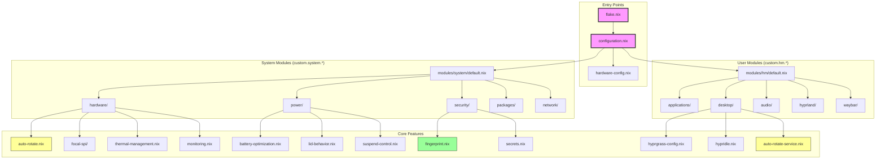

---

## Configuration Flow

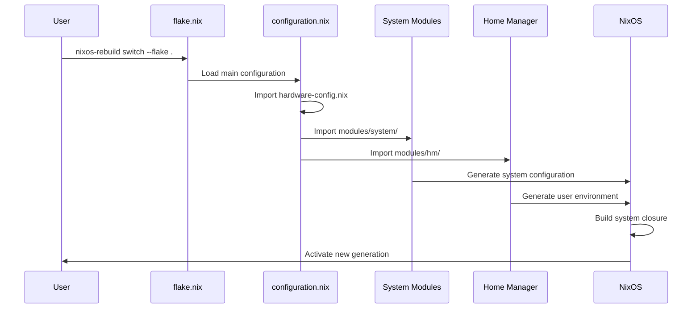

---

## Module Dependency Graph

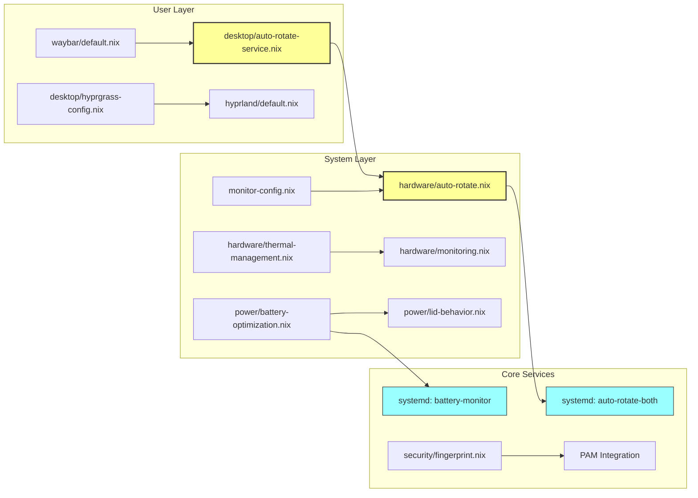

---

## Hardware Stack

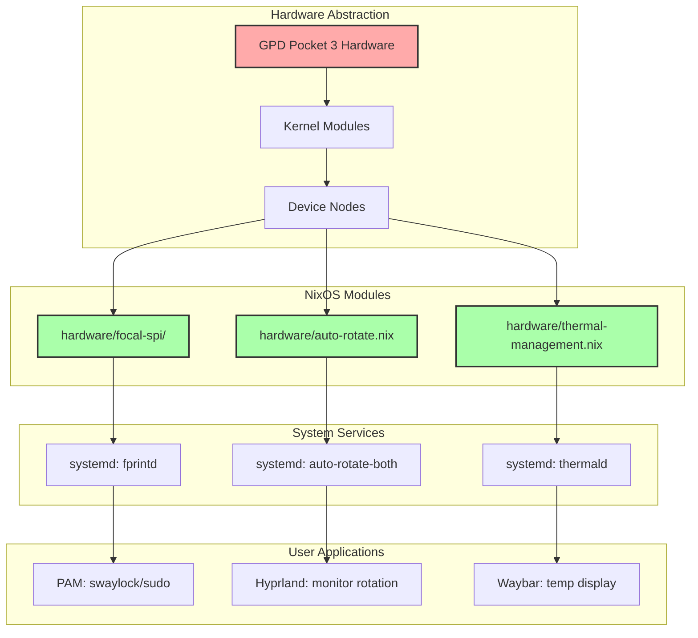

---

## Screen Rotation System

**Problem:** Multiple modules handle rotation - which is active?

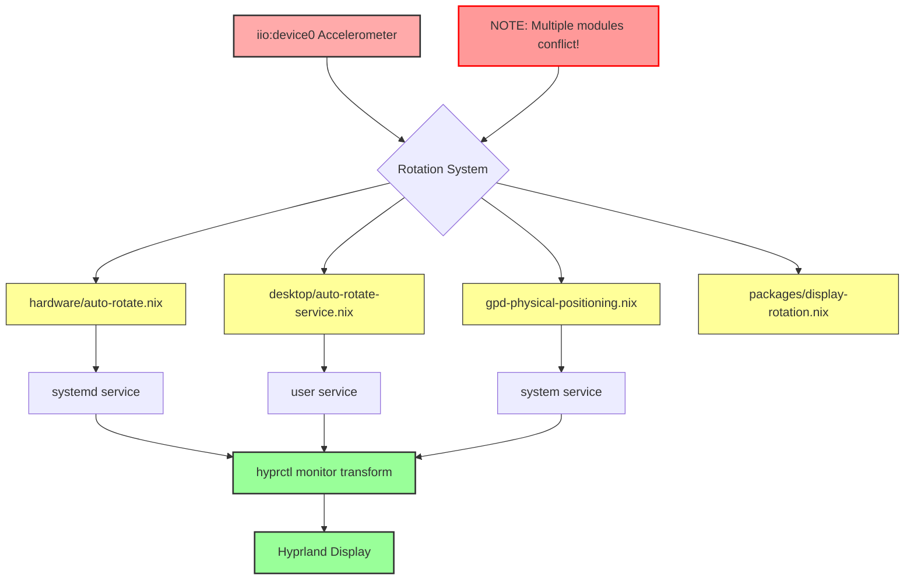

**Current Status:** Multiple rotation implementations exist. Recommended: Use `custom.hm.desktop.autoRotateService.enable = true` (user service) or `custom.system.hardware.autoRotate.enable = true` (system service), not both.

---

## Boot Process Flow

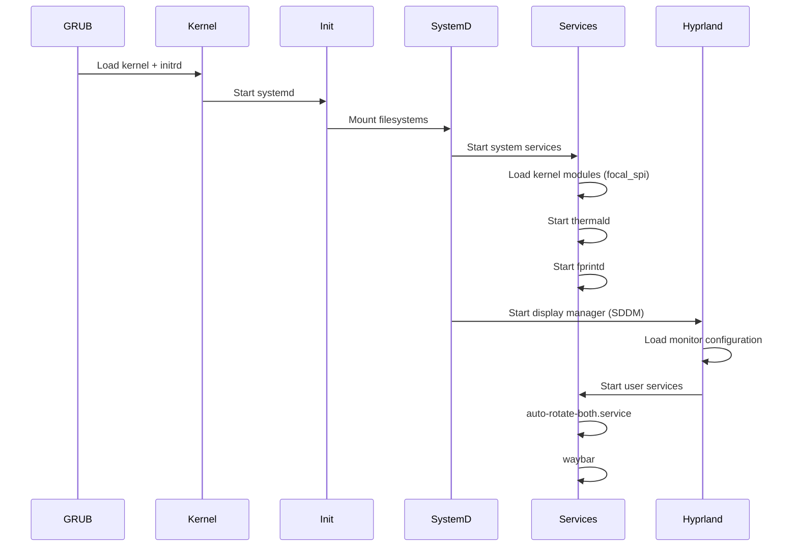

---

## Package Management Architecture

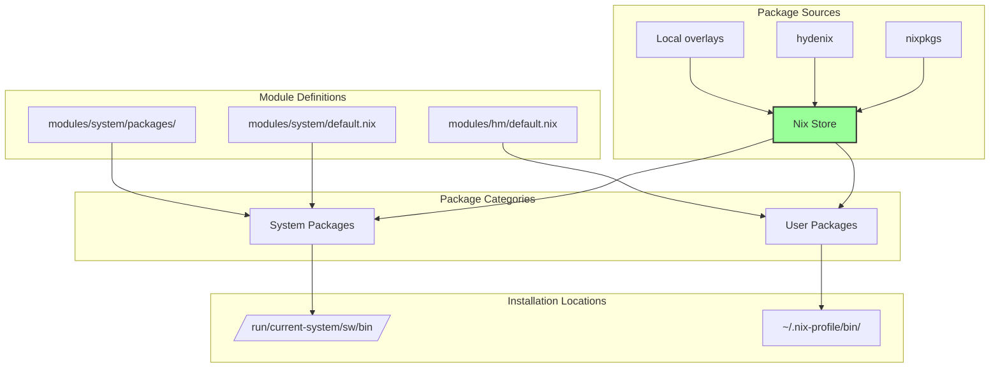

---

## Service Architecture

### System Services (root)

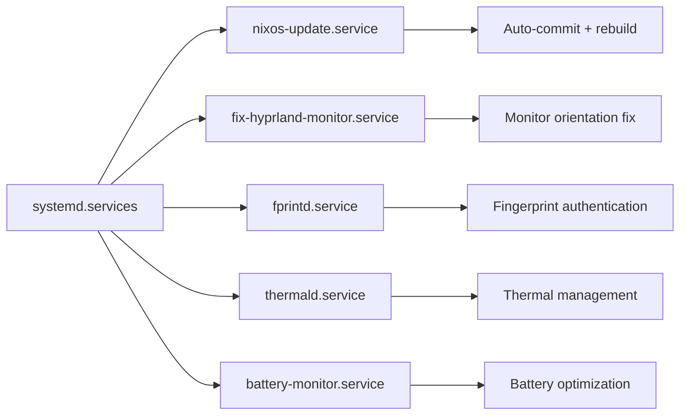

### User Services

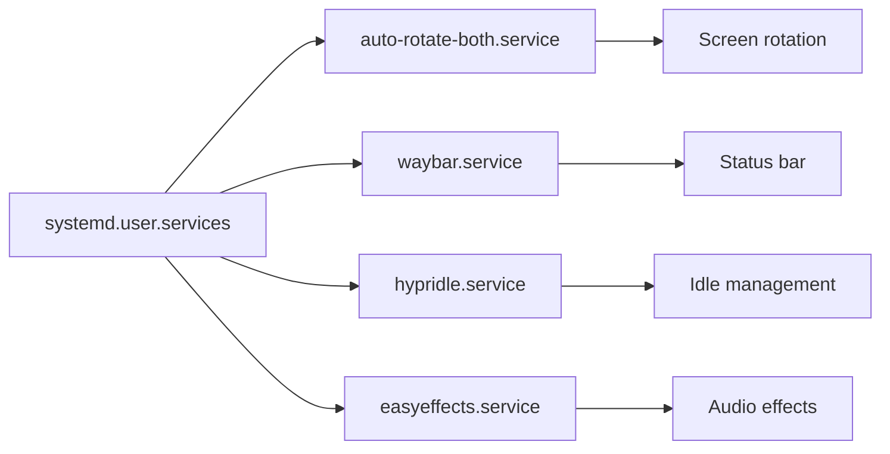

---

## File System Layout

```
/nix-modules/
├── flake.nix                      # Flake definition, inputs, outputs
├── configuration.nix              # Main system config (user, hostname, etc.)
├── hardware-config.nix            # Smart hardware detection wrapper
├── modules/
│   ├── system/                    # System-level modules (custom.system.*)
│   │   ├── default.nix           # Aggregator (292 lines)
│   │   ├── hardware/
│   │   │   ├── auto-rotate.nix   # ✅ Recommended rotation module
│   │   │   ├── focal-spi/        # FTE3600 fingerprint support
│   │   │   ├── thermal-management.nix
│   │   │   └── monitoring.nix
│   │   ├── power/
│   │   │   ├── battery-optimization.nix
│   │   │   ├── lid-behavior.nix
│   │   │   └── suspend-control.nix
│   │   ├── security/
│   │   │   ├── fingerprint.nix   # PAM integration
│   │   │   └── secrets.nix       # KeePassXC
│   │   └── packages/
│   │       ├── superclaude.nix
│   │       ├── claude-code.nix
│   │       └── mcp/
│   └── hm/                        # Home Manager modules (custom.hm.*)
│       ├── default.nix           # Aggregator (155 lines)
│       ├── applications/
│       ├── audio/
│       ├── desktop/
│       │   ├── auto-rotate-service.nix  # ✅ User rotation service
│       │   ├── hyprgrass-config.nix
│       │   └── hypridle.nix
│       ├── hyprland/             # Hyprland config (212 lines)
│       └── waybar/               # Waybar config (298 lines)
├── docs/                          # Documentation
│   ├── NAVIGATION.md             # 📍 Start here
│   ├── troubleshooting-checklist.md
│   ├── migration.md
│   └── architecture.md           # 👈 You are here
└── .claude/                       # SuperClaude framework
```

---

## Data Flow: User Command to System Change

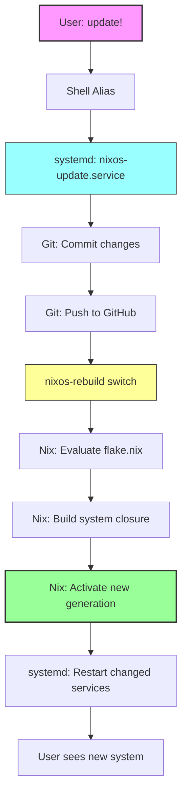

---

## Input Validation Flow (NEW)

With the UX improvements, modules now validate inputs:

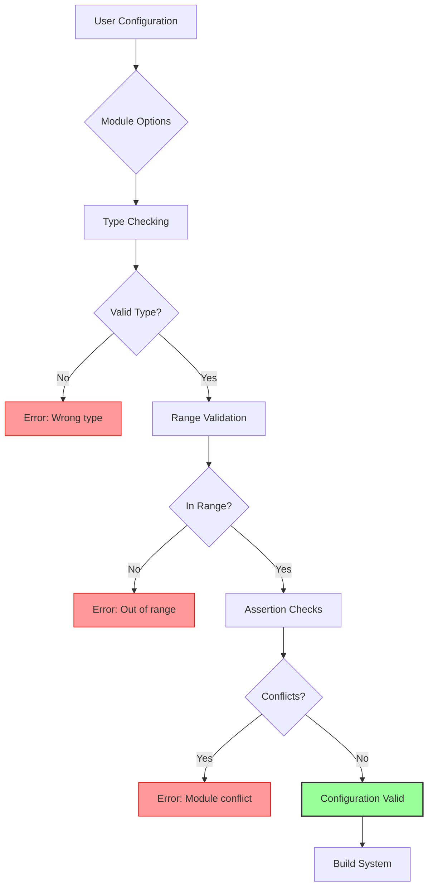

**Example Validations:**
- `scale`: Must be 0.5-3.0
- `transform`: Must be 0, 1, 2, or 3
- `resolution`: Must match format `WIDTHxHEIGHT@REFRESH`
- **Conflicts:** Cannot enable both `autoRotate` and `gpdPhysicalPositioning.autoRotation`

---

## Security Model

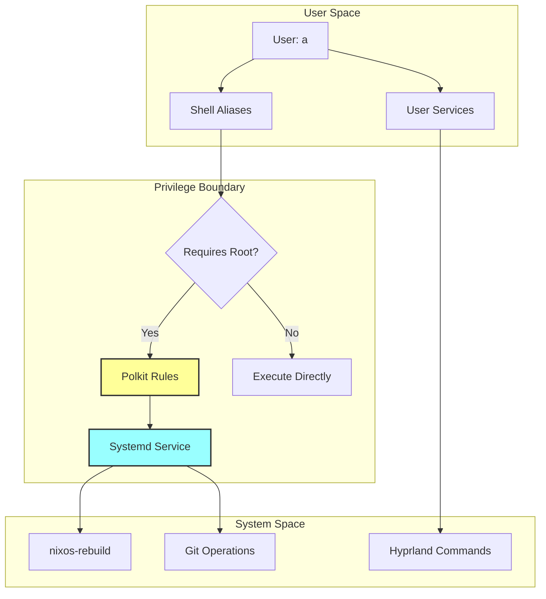

**Security Improvements:**
- ❌ OLD: Hardcoded `echo 7 | sudo -S` in scripts
- ✅ NEW: Polkit rules + systemd services (no password in code)

---

## Module Lifecycle

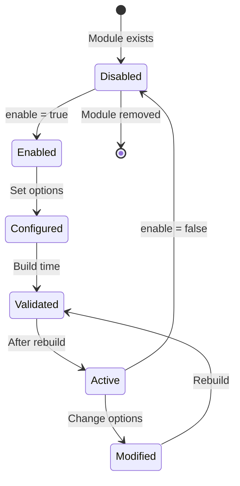

---

## Troubleshooting Flow

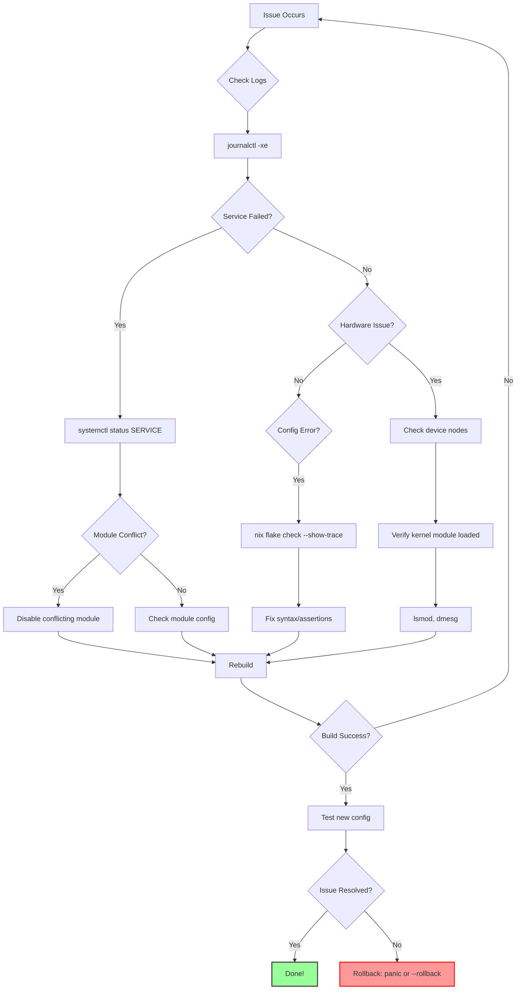

---

## Integration Points

### Hydenix Framework Integration

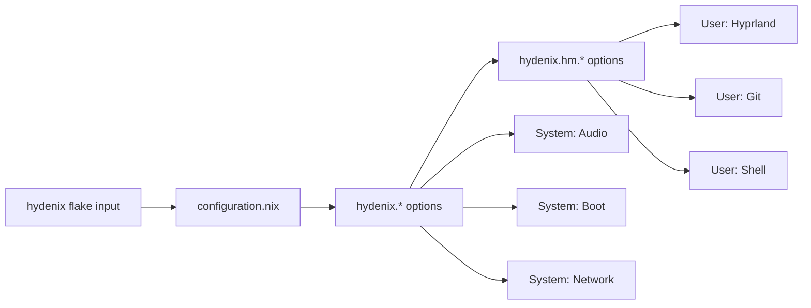

### SuperClaude Framework Integration

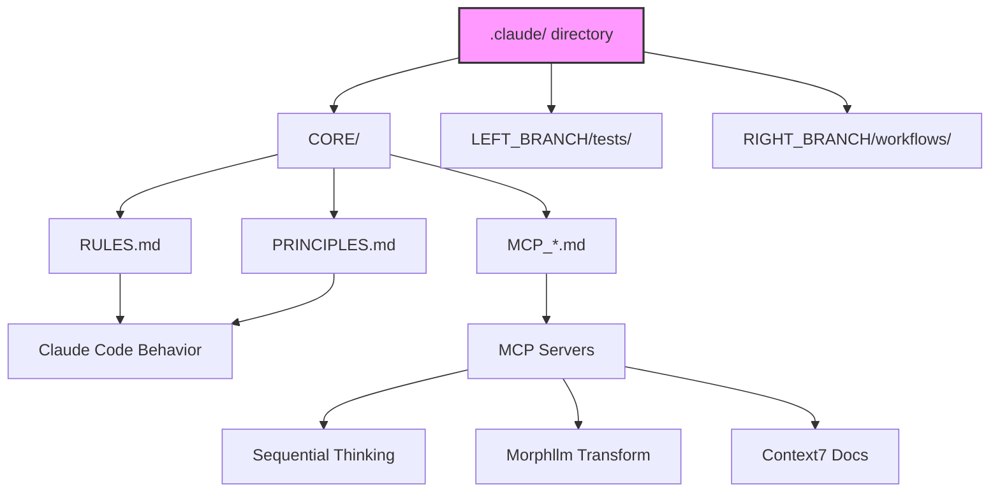

---

## Performance Characteristics

### Build Times

```
Cold build (no cache):     ~15-20 minutes
Warm build (cached):       ~2-3 minutes
Incremental (small change):  ~30-60 seconds
```

### Service Startup Times

```
auto-rotate-both:          ~2s (waits for accelerometer)
fprintd:                   <1s
thermald:                  <1s
waybar:                    ~1s
Hyprland:                  ~2-3s
```

---

## Future Architecture Improvements

**Planned (based on UX audit):**

1. **Rotation Consolidation** - Merge 19 rotation modules into single implementation
2. **Auto-Documentation** - Generate options.html from module definitions
3. **Module Deprecation System** - Clear migration paths for old modules
4. **Automated Testing** - NixOS VM tests for each module
5. **CI/CD Pipeline** - Automated docs and testing on push

---

## Additional Resources

- **Module Documentation:** [Options Reference](./options-reference.md)
- **Configuration Guide:** [NAVIGATION.md](./NAVIGATION.md)
- **Developer Guide:** [CLAUDE.md](../CLAUDE.md)
- **Troubleshooting:** [troubleshooting-checklist.md](./troubleshooting-checklist.md)

---

**Last Updated:** 2025-10-01
**Diagram Tool:** Mermaid.js (renders in GitHub/most markdown viewers)
